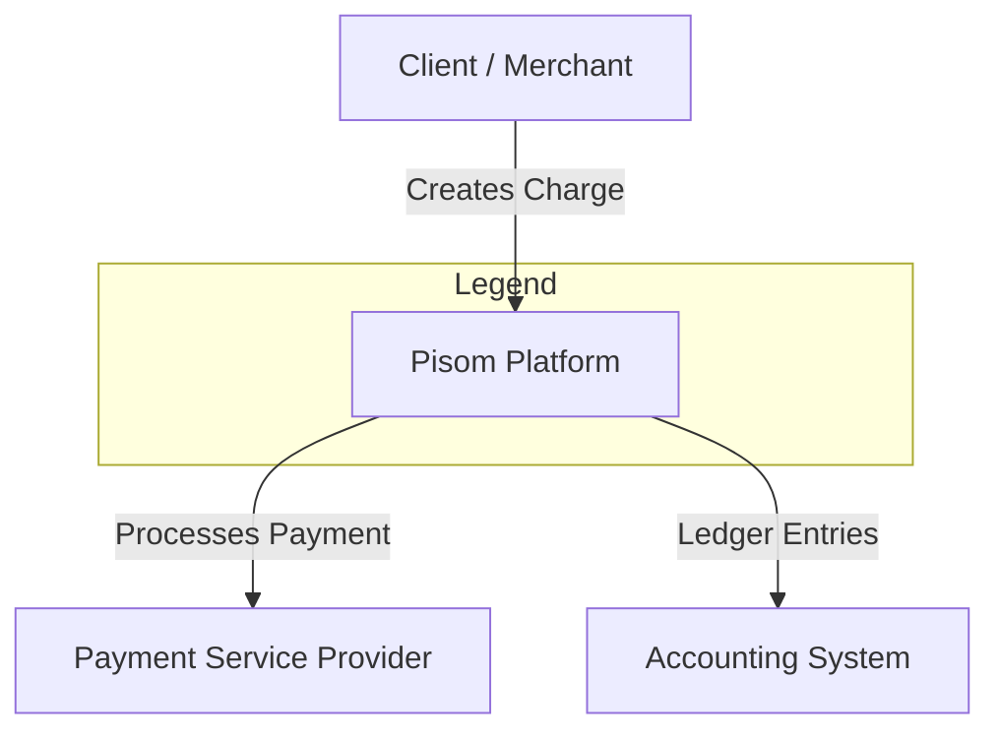

# Pisom Architecture

This repository contains the architectural documentation and decision records for the Pisom Platform.

## Decision Process
We adopt the Architectural Decision Records (ADR) pattern as described by Michael Nygard and recommended by Martin Fowler. This ensure that every significant technical choice is documented with its context, rationale, and trade-offs.

## Standards
The project follows the AWS Prescriptive Guidance for ADR governance and the [C4 Model](https://c4model.com/) for visual representation of software architecture.

## Structure
- /adr: Chronological log of architectural decisions.
- /diagrams: System design and flow representations.

## References
- Documenting Architecture Decisions (Michael Nygard)
- Architectural Decision Records (Martin Fowler)
- AWS Prescriptive Guidance: [ADR Process](https://docs.aws.amazon.com/prescriptive-guidance/latest/architectural-decision-records/adr-process.html#contents)

